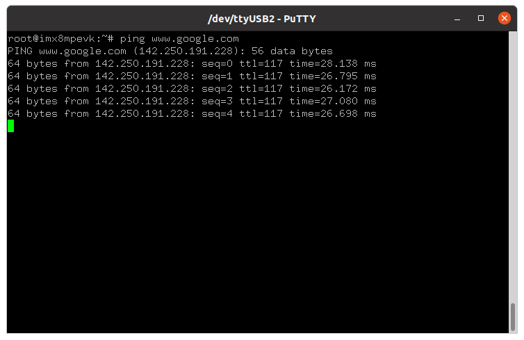
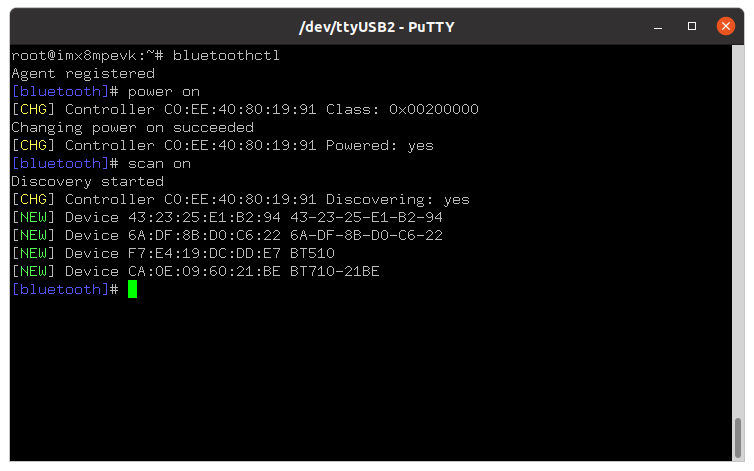

# LWB5+ i.MX 8M Plus Yocto Integration (lrd-11.0)

 This tutorial will show you how to integrate the LWB5+ on an i.MX 8M Plus EVK.The Sterling-LWB5+ has various models with different interfaces for Wi-Fi and Bluetooth depending on the model chosen. It is assumed the user is familiar with Linux and embedded systems. Included in this tutorial is the physical setup including hardware modifications needed, the Yocto setup and build, and verifying the Wi-Fi and Bluetooth are functional.  

 **Note:** This guide is for Laird backports version lrd-11.x and higher. For Laird code lrd-10.x or lower please see: https://lairdcp.github.io/guides/lwb5plus-tutorials/1.0/LWBplusDongle-imx8-yocto.html

## Required Tools

   - [LWB5+](https://www.lairdconnect.com/wireless-modules/wifi-modules-bluetooth/sterling-lwb5-plus-wifi-5-bluetooth-5-module)
   - i.MX 8M Plus EVK (Part No. 8MPLUSLPD4-EVK)
   - Linux PC with a Yocto Build Environment. As a prerequisite for this tutorial, we are going to assume that you know how to setup a Yocto build environment. This is covered very well in NXP's documentation ( i.e. see [i.MX_Yocto_Project_User's_Guide.pdf, Rev. L5.4.70_2.3.0 — 31 December 2020](https://community.nxp.com/pwmxy87654/attachments/pwmxy87654/imx-processors/171785/1/i.MX_Yocto_Project_User's_Guide.pdf) for details on how to install the required *host packages* and the *repo utility*, and how to setup *git*); so we will not cover it here. We will focus on how to add Laird Connectivity's external layer into a Yocto build. 

## Yocto setup and build

#### Create project folders

```
mkdir -p ~/projects/yocto-mickledore
cd ~/projects/yocto-mickledore
```   

#### Download Yocto Mickledore release

```
repo init -u https://github.com/nxp-imx/imx-manifest -b imx-linux-mickledore -m imx-6.1.22-2.0.0.xml
repo sync
```
**Note:** At the time of writing version 6.1.22-2.0.0 is the latest Mickledore release. Please check https://github.com/nxp-imx/imx-manifest for the latest available version. 

#### Setup build config

Create a build directory and set the DISTRO and MACHINE type.

```
DISTRO=fsl-imx-fb MACHINE=imx8mpevksource imx-setup-release.sh -b build-imx8mp
```

#### Resourcing environment

If the terminal is closed the environment will need to be resourced.

```
cd ~/projects/yocto-mickledore
. setup-environment build-imx8mp


Welcome to Freescale Community BSP

The Yocto Project has extensive documentation about OE including a
reference manual which can be found at:
    http://yoctoproject.org/documentation

For more information about OpenEmbedded see their website:
    http://www.openembedded.org/

You can now run 'bitbake <target>'

Common targets are:
    core-image-minimal
    meta-toolchain
    meta-toolchain-sdk
    adt-installer
    meta-ide-support

Your configuration files at build-imx6ullevk/ have not been touched.

```
#### Edit local.conf

Edit the file ~/projects/yocto-mickledore/build-imx8mp/conf/local.conf add the following to the end of the file.

```
PREFERRED_PROVIDER_wpa-supplicant = "summit-supplicant-lwb"
PREFERRED_PROVIDER_wpa-supplicant-cli = "summit-supplicant-lwb"
PREFERRED_PROVIDER_wpa-supplicant-passphrase = "summit-supplicant-lwb"
PREFERRED_RPROVIDER_wireless-regdb-static = "wireless-regdb"
LWB_REGDOMAIN = "US"
```
**Note:** You do not need to use LWB_REGDOMAIN to specify the regulatory domain. You could choose to implement it using a device tree setting or configure the module parameter some other way. However, the regulatory domain must be configured for the LWB5+ in some manner

#### Edit bblayers.conf
Edit your bblayer.conf file and add the following to the bottom. 

```
BBLAYERS += "${BSPDIR}/sources/meta-summit-radio/meta-summit-radio"
```
#### Download Laird Yocto meta-layer (meta-summit-radio)
```
cd ~/project_directory/sources

#clone the Laird meta layer for yocto
git clone -b lrd-11.39.0.x https://github.com/LairdCP/meta-summit-radio
```
**Note:** At the time this document was written version 11.39.0.x was the latest release of Laird Backports. There may be a new version available. Please check https://github.com/LairdCP/meta-summit-radio for the latest image. 

#### Copy sample image recipe

Copy a sample image recipe and rename the recipe to something memorable. Here I've used my name, the product name, the product interface (usb/usb), the EVK it is built for and the meta-summit-radio current release for the image recipe name.

In the end the filename will be: bob-lwbp-usus-imx8mp-lrd11.rootfs.wic.zst giving a nice understanding who built it, what Wi-Fi module it's for, the interface used, which driver release and platform.


cd ~/project_directory/sources/meta-summit-radio/meta-summit-radio/recipes-packages/images

#### LWB5+ Interfaces
The Sterling-LWB5+ comes in many different modules, with different interfaces for both Wi-Fi and Bluetooth and different firmware files for each. Please see the chart below for details
| Part Number| Form Factor | Antenna | Wi-Fi Interface| Bluetooth Interface | Firmware Filename |
| ------ | ------ | ------ | ------ | ------ | ------|
| 453-00045 | Solder-down | Integrated Chip | SDIO or USB | UART or USB | lwb5plus-sdio-sa-firmware or lwb5plus-usb-sa-firmware |
| 453-00046 | Solder-down | MHF4L | SDIO or USB | UART or USB | lwb5plus-sdio-sa-firmware or lwb5plus-usb-sa-firmware |
| 453-00047 | Solder-down | Trace pin | SDIO or USB | UART or USB | lwb5plus-sdio-sa-firmware or lwb5plus-usb-sa-firmware |
| 453-0048 | M.2 | MHF4L x2 | SDIO | UART | lwb5plus-sdio-div-firmware (2 antennas)lwb5plus-sdio-sa-m2-firmware (1 antenna) |
| 453-0049 | M.2 | MHF4L x2 | USB | USB | lwb5plus-usb-div-firmware (2 antennas)lwb5plus-usb-sa-m2-firmware (1 antenna) |
| 450-00137 | USB Dongle | Integrated Chip | USB | USB | lwb5plus-usb-sa-firmware |
```
#copy the bitbake recipe example
cp sample-image-lwb5plus.bb bob-lwbp-usus-imx8mp-lrd11.bb
```

3. Modify the *~/projects/imx8mp/build-imx8p-wayland/conf/bblayers.conf* file. Add the line below to the file.

   ```
   BBLAYERS += "${BSPDIR}/sources/meta-summit-radio/meta-summit-radio" 
   ```
   Note: for Yocto projects 3.3 (Hardknott) and earlier the line you add would be 
```
   BBLAYERS += "${BSPDIR}/sources/meta-summit-radio/meta-summit-radio-pre-3.4"
```
   

4. Modify the  *~/projects/imx8mp/build-imx8p-wayland/conf/local.conf* file.  Add the lines below to the file.

   ```
   PREFERRED_PROVIDER_wpa-supplicant = "sterling-supplicant" 
   PREFERRED_PROVIDER_wpa-supplicant-cli = "sterling-supplicant" 
   PREFERRED_PROVIDER_wpa-supplicant-passphrase = "sterling-supplicant" 
   
   BBMASK += " \ 
       meta-summit-radio/meta-summit-radio/recipes-packages/openssl \ 
       meta-summit-radio/meta-summit-radio/recipes-packages/.*/.*openssl10.* \ 
       "
   
   PREFERRED_RPROVIDER_wireless-regdb-static = "wireless-regdb" 
   LWB_REGDOMAIN = "US" 
   ```
Note: for Yocto projects 3.3 (Hardknott) and earlier you would add:
```
 PREFERRED_PROVIDER_wpa-supplicant = "sterling-supplicant" 
   PREFERRED_PROVIDER_wpa-supplicant-cli = "sterling-supplicant" 
   PREFERRED_PROVIDER_wpa-supplicant-passphrase = "sterling-supplicant" 
   
   BBMASK += " \ 
       meta-summit-radio/meta-summit-radio-pre-3.4/recipes-packages/openssl \ 
       meta-summit-radio/meta-summit-radio-pre-3.4/recipes-packages/.*/.*openssl10.* \ 
       "
   
   PREFERRED_RPROVIDER_wireless-regdb-static = "wireless-regdb" 
   LWB_REGDOMAIN = "US" 
   ```
   

5. Clone the meta-summit-radio layer into *~/projects/imx8mp/sources* directory

   ```
   cd ~/projects/imx8mp/sources
   git clone https://github.com/LairdCP/meta-summit-radio
   ```

   

6. Edit the *~/projects/imx8mp/sources/meta-summit-radio/meta-summit-radio/recipes-packages/images/sample-image-cp-lwb5plus.bb* recipe by replacing *lwb5plus-sdio-div-firmware* with *lwb5plus-usb-sa-firmware* and adding *laird-networkmanager*. Then save it as *mylwb5p.bb*. A snippet of the saved file is shown below.
Note: for Yocto project 3.3 (Hardknott) and earlier you would edit ~/projects/imx8mp/sources/meta-summit-radio/meta-summit-radio-pre-3.4/recipes-packages/images/sample-image-cp-lwb5plus.bb

   ```
   IMAGE_INSTALL += "\ 
   iproute2 \ 
   rng-tools \ 
   ca-certificates \ 
   tzdata \ 
   alsa-utils \ 
   htop \ 
   ethtool \ 
   iperf3 \ 
   tcpdump \ 
   iw \ 
   kernel-module-lwb5p-backports-summit \ 
   lwb5plus-usb-sa-firmware \ 
   sterling-supplicant-lwb \ 
   summit-networkmanager-st60 \ 
   " 
   ```

   


7. Next go to the build directory and run menuconfig to configure the Kernel.

   ```
   cd ../build-imx8p-wayland 
   bitbake -c menuconfig virtual/kernel
   
   ```

   - Disable Wireless LAN drivers. Navigate to *Device Drivers* -> *Network device support* and disable *Wireless LAN* .

     

     

     

   - Disable Bluetooth subsystem support and Wireless. Navigate to *Networking support* and disable *Bluetooth subsystem* *support* and *Wireless*.

     

     

     
     
   - Save your changes and exit menuconfig

     

8. Build the image

    ```
    bitbake mylwb5p
    ```

    

9. Flash image into SD card. **Note:** for this particular tutorial the SD card is on /dev/mmcblk0. It may be different for your setup; so make sure you change the command below per your setup.

    ```
    bzip2 -dc ~/projects/imx8mp/build-imx8p-wayland/tmp/deploy/images/imx8mpevk/mylwb5p-imx8mpevk.wic.bz2 | sudo dd bs=512K iflag=fullblock oflag=direct status=progress conv=fsync of=/dev/mmcblk0
    
    sync
    ```

    

10. Connect EVK to Serial Terminal via J23 (115200, N, 8, 1). Note for this tutorial we use */dev/ttyUSB2* port to connect. Your Linux PC might use a different port. Boot device and login as root.

    

11. Test Wi-Fi. Create a connection profile with nmcli. Then connect to the AP and ping a website.

     ```
     nmcli con add con-name "YourProfile" ifname wlan0 type wifi ssid "YourAP" wifi-sec.key-mgmt wpa-psk wifi-sec.psk "YourPassword" 
     nmcli c u "YourProfile" 
     ping www.google.com
     ```

     

     

12. Test Bluetooth. Launch *bluetoothctl*. Then on the *bluetoothctl* prompt, type *power on* and then *scan on*.

     

     

     

## References

- https://github.com/LairdCP/meta-summit-radio
- The modified files on this tutorial
  - [bblayers.conf](../src/dongle/bblayers.conf)
  - [local.conf](../src/dongle/local.conf)
  - [mylwb5p.bb](../src/dongle/mylwb5p.bb)
- https://www.nxp.com/imx8mplusevk